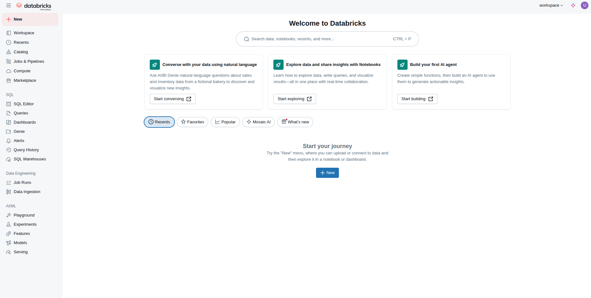
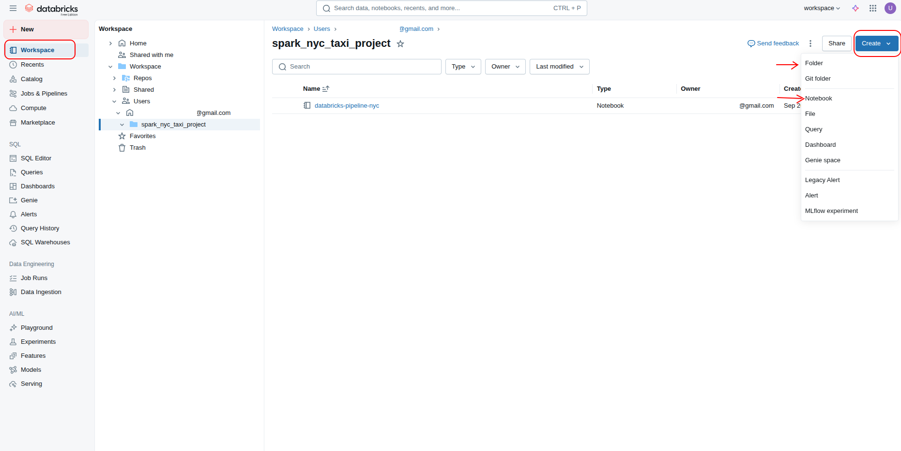
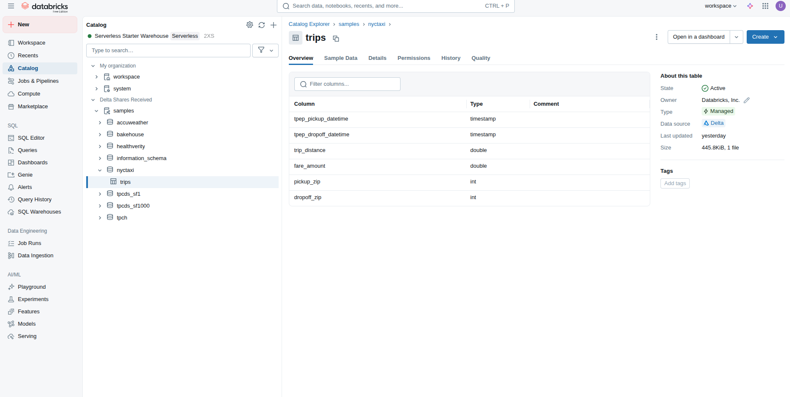
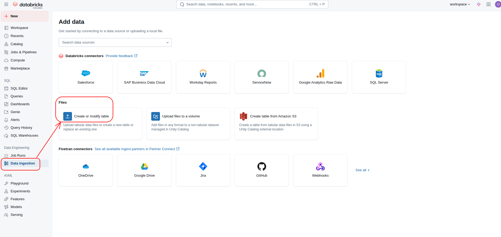
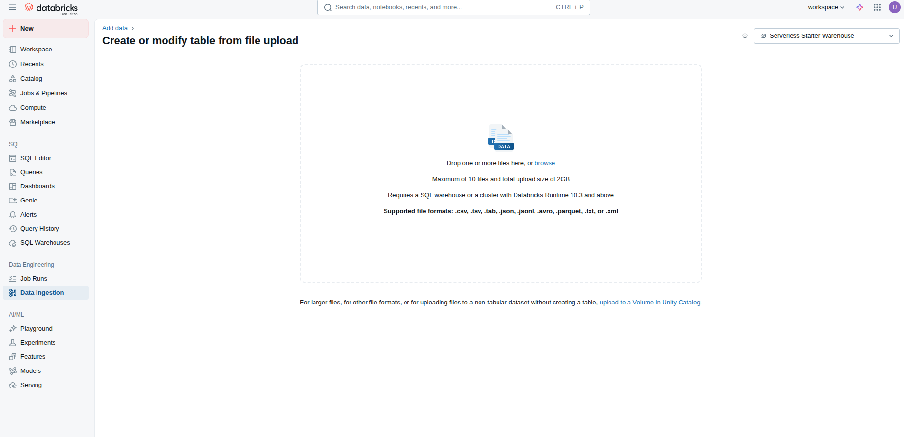
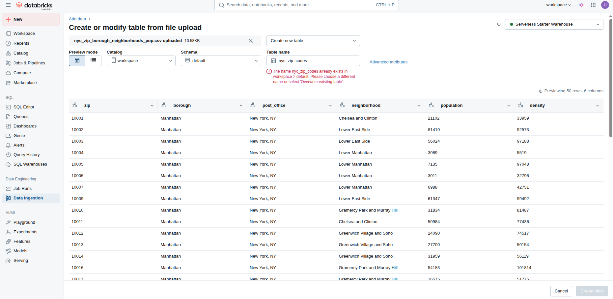
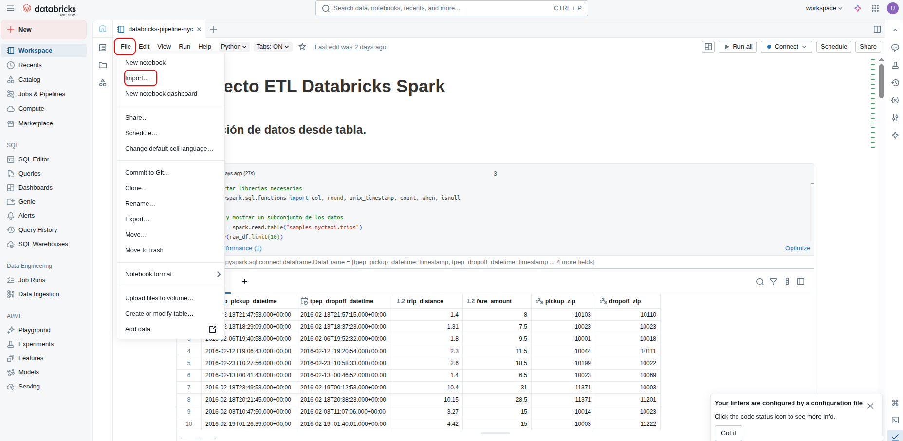
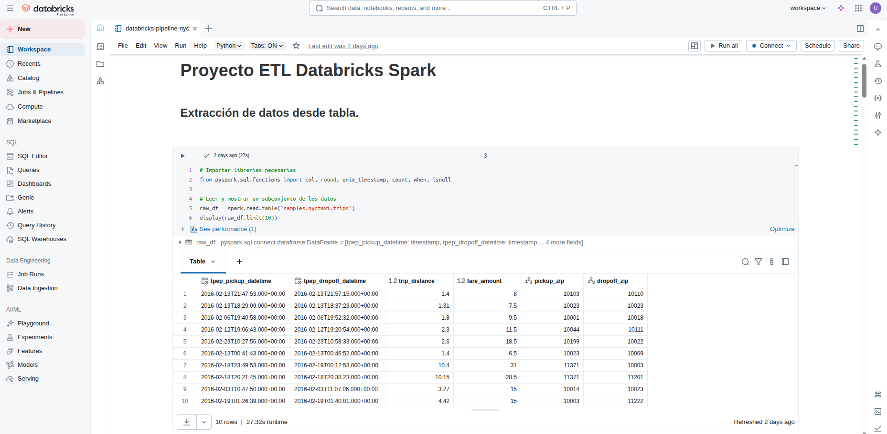

# Databricks + PySpark pipeline-EDA
## Objetivos
Este proyecto tiene como objetivo conocer la plataforma de databricks y los servicios que brinda para la *ingeniería de datos*.

Se aborda desde la perspectiva de una pipeline de datos con un análisis exploratorio utilizando **PySpark** y **SQL**.

## Estructura del repositorio
```
databricks-pipeline-nyc/
├── img/ # Imágenes de soporte para el README.md
├── input_data/
|   └── nyc_zip_borough_neighborhoods_pop.csv
├── notebook/
│   └── databricks-pipeline-nyc.ipynb
├── databricks-pipeline-nyc.html  # A renderizar por GitHub Pages.
├── README.md
```
## Setup del entorno 
### 1. Crea una cuenta en [databricks](https://www.databricks.com/).



### 2. Crea una carpeta y un notebook nuevo en python



### 3. Datos

Vamos a trabajar con un documento gubernamentales de la comisión de taxis y limusinas de la ciudad de Nueva York - Estados Unidos. 

Vamos a aprovechar que **Databricks** nos brinda una tabla alojada en Amazon S3 con estos datos. 

Si quieres puedes descargar la información localmente y conocer más [aquí](https://www.nyc.gov/site/tlc/about/tlc-trip-record-data.page).

Adicional a esta información, vamos a trabajar con un archivo **.csv** que tenemos alojado en este repositorio ```/databricks-pipeline-nyc/input_data/nyc_zip_borough_neighborhoods_pop.csv```. Este archivo contiene columnas para codigo postal y los nombres de los barrios que corresponden. Esta información nos servirá para cruzar información con la tabla alojada en *Databricks*.

Para cargar esta información y convertirla en una tabla sigue los siguientes pasos:



Arrastra el archivo **nyc_zip_borough_neighborhoods_pop.csv**


Cambia el nombre de la tabla a: **nyc_zip_codes**. Luego click en **Create table**. Más tarde haremos uso de esta información.


### 4. ETL + EDA
Importa el archivo ```/notebook/databricks-pipeline-nyc.ipynb```



### 5. Resultados
He dejado un archivo **.html** en este repositorio para ser renderizado en **Github Pages** y puedas ver mi trabajo. Por favor haz [click aquí](https://ulloa-g.github.io/databricks-pipeline-nyc/databricks-pipeline-nyc.html).


